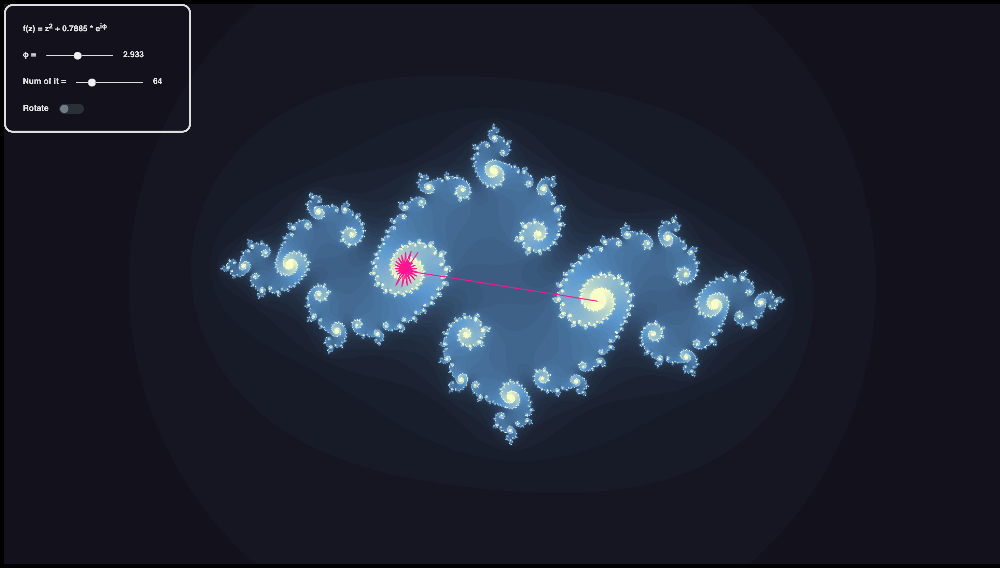

# Interactive_julia

This is a website built using Webassembly for Rust. It displays a [Julia Set](https://en.wikipedia.org/wiki/Julia_set) for the given quadratic formula.
By clicking on any pixel, you can see the iteration points of the function. [Try it yourself](https://simon-hostettler.github.io/interactive_julia/)

# Example

